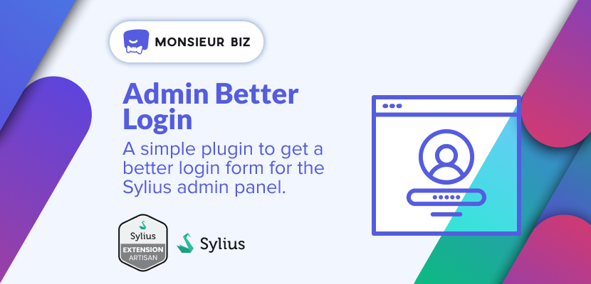
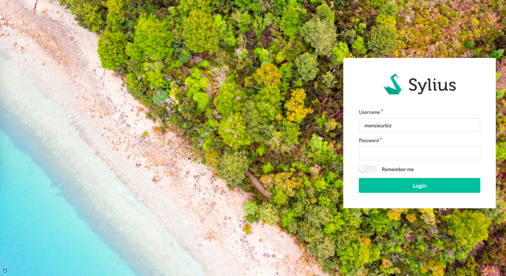
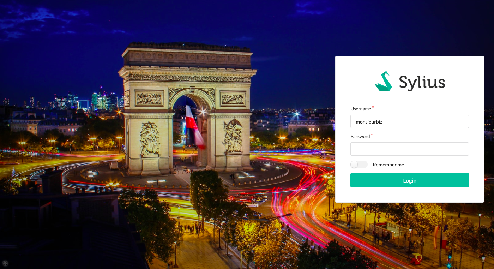

# ⚠️ This plugin is depracated due to a limitation of Unsplash API. Please use [monsieurbiz/SyliusBetterAdminPlugin](https://github.com/monsieurbiz/SyliusBetterAdminPlugin) instead.

[](https://monsieurbiz.com/agence-web-experte-sylius)

<h1 align="center">Sylius Admin Better Login</h1>

[](https://github.com/monsieurbiz/SyliusAdminBetterLoginPlugin/blob/master/LICENSE.txt)
[](https://github.com/monsieurbiz/SyliusAdminBetterLoginPlugin/actions?query=workflow%3ATests)
[](https://github.com/monsieurbiz/SyliusAdminBetterLoginPlugin/actions?query=workflow%3ASecurity)
[](https://github.com/monsieurbiz/SyliusAdminBetterLoginPlugin/actions?query=workflow%3ASecurity)

This plugin changes the way you log to your admin panel by adding a beautiful background
and focusing on the username (or password) field.

The backgrounds are from [Unsplash](https://unsplash.com/).  
Thank you to all the authors.



## Compatibility

| Sylius Version | PHP Version |
|---|---|
| 1.11 | 8.0 - 8.1 |
| 1.12 | 8.1 - 8.2 |
| 1.13 | 8.1 - 8.2 |

## Installation

If you want to use our recipes, you can configure your composer.json by running:

```bash
composer config --no-plugins --json extra.symfony.endpoint '["https://api.github.com/repos/monsieurbiz/symfony-recipes/contents/index.json?ref=flex/master","flex://defaults"]'
```

```bash
composer require monsieurbiz/sylius-admin-better-login-plugin
```

Then you have to declare it in your `config/bundles.php`:

```php
<?php
return [
    // …
    MonsieurBiz\SyliusAdminBetterLoginPlugin\MonsieurBizSyliusAdminBetterLoginPlugin::class => ['all' => true],
];
```

You can copy the template of the login page as well, it's optional.  
But we strongly suggest it, otherwise you won't be able to really enjoy the background 🙃.

```bash
mkdir -p templates/bundles/
cp -Rv vendor/monsieurbiz/sylius-admin-better-login-plugin/src/Resources/views/SyliusUiBundle templates/bundles/
```

## How it works

When you load the login page we make a HTTP request to get a random image on Unsplash.  
We keep the random image's URL in your local storage for the rest of the day.

If you don't like the image, there is a small button `⟲` in the left footer of the page. 

## Change the theme of the images

You can do that!
Simply change the default tags (`nature` and `water`) with your owns in your project configuration:

```
monsieurbiz_sylius_admin_better_login:
    tags: ['paris by night']
```



## Testing

See [TESTING.md](TESTING.md).

## Contributing

You can open an issue or a Pull Request if you want! 😘  
Thank you!
